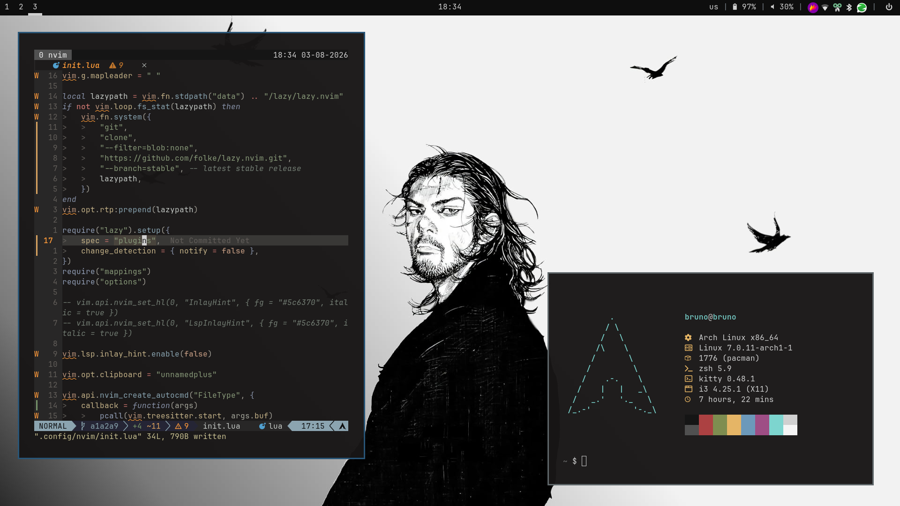

# About

A repository containing my personal dotfiles for a Arch Linux setup.
This repository focus on setting up a simple and productive workstation that just works.


Key components
- OS: Arch Linux
- WM: i3
- Shell: zsh
- Terminal: kitty
- Editor: Neovim

## Quick setup

Install yadm:

```bash
$ sudo pacman -S git yadm
```

Clone the repository:
```bash
$ yadm clone https://github.com/fenikiss/dotfiles.git
```
You will be asked to 'bootstrap' this repository, just type 'y'.

Remove the install script (recommended):
```bash
$ rm arch-install.sh
```

## Install script

A tiny script that will automatically install Arch Linux on your machine.

This arch install will have:
- LUKS on LVM
- btrfs with snapshots

**Setup:**

Install curl on your archiso:
```bash
$ sudo pacman -Sy curl
```

Download and run:
```bash
$ bash <(curl -sL bit.ly/fenikiss-arch-install)
```

## Caution

- You should NEVER run a bash script without reading it contents.
This install script will erase all content on a selected disk and install contents
of my choice.
- These are MY personal configs. They may overwrite your existing configuration
- I don't have any responsability for damages caused on your machine
after running the install script or bootstrapping the dotfiles.

## License

Copyright 2026 Bruno Guimarães Souza. All rights reserved.
Use of this source code is governed by a MIT license that
can be find in the LICENSE file.
